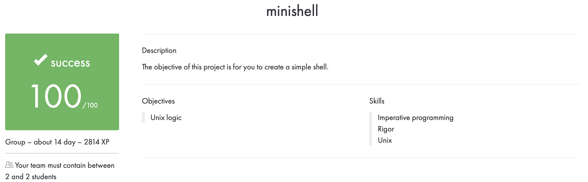

# minishell

## Description

With a partner, we wrote a simple shell.

In this project, we use some functions from [my libft library](https://github.com/VitMarKha/libft), as well as some functions we modify.

The compilation was performed as follows: ``gcc -Wall -Wextra -Werror``.

All files pass to ``Norminette``.

No memory leaks.

## Using

``make`` and ``make all`` compile the library ``libfе.a``, placing them in the root folder.

``make re`` deletes all ``.o`` files, deletes ``libfе.a``, rebuilds the project.

``make clean`` deletes all ``.o`` files.

``make fclean`` deletes all ``.o`` files, also deletes ``libfе.a`` and ``minishell_history``.

Starting the program: ``./minishell``.

## Evaluation

